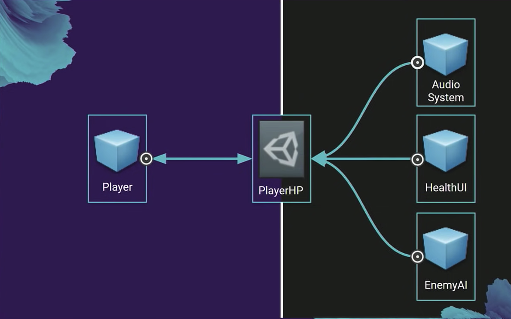

### Solutions for the singleton problem
- Reduce the need for global managers
- Inversion of control
  - Objects are given dependencies

### Modular data
- To reduce the global state.
  - EnemyManager.Instance.MoveSpeed?
    - Hard reference
    - Dependency problems
  - EnemyConfig ScriptableObject?
    - One SO for all enemy stats together.
      - Kind of breaks modularity.
  - ScriptableObject Variables

```CSharp
[CreateAssetMenu]
public class FloatVariable : ScriptableObject
{
	public float Value;
}
```

```CSharp
public class DumbEnemy : MonoBehaviour
{
	public FloatVariable MaxHP;
	public FloatVariable MoveSpeed;
}
```

This can get very troublesome.

```CSharp
[Serializable]
public class FloatReference
{
	public bool UseConstant = true;
	public float ConstantValue;
	public FloatVariable Variable;

	public float Value
	{
		get {return UseConstant ? ConstantValue : Variable.Value;}
	}
}
```

```CSharp
public class DumbEnemy : MonoBehaviour
{
	public FloatReference MaxHP;
	public FloatReference MoveSpeed;
}
```

- This allows modularity & better separation. For example let's say there is a Player prefab that uses a PlayerHP FloatReference. The player takes damage and decrements the PlayerHP. Meanwhile another prefab called Health UI uses the PlayerHP and displays it's value.

- This allows to share data between systems.

### Event architecture
- Helps to modularize systems.
  - Reusable
  - Isolates prefabs
- Optimizes busy checking.
- Highly debuggable.

## UnityEvent
- Serialized function call.
  - Advantages:
    - Editor hook-ups, allows modularity. Doesn
    - Less code, fewer assumptions.
    - You can pass arguments. You can extend `UnityEvent<T>`
  - Problems:
    - Rigid bindings: a button needs to know what object responds to it. Hard references.
    - Limited serializations:
      - int, string, bool, UnityEngine.Object
	- Garbage allocations, it's a serialized function call.
- Making our own events.
  - Data driven
  - Designer authorable
  - Debuggable


```CSharp
[CreateAssetMenu]
public class GameEvent : ScriptableObjects
{
	private List<GameEventListener> listener = new List<GameEventListener>();

	public void Raise()
	{
		// looping backwards: a listener response can include removing the listener.
		for (var i = listener.Count - 1; i >= 0; i--)
		{
			listener[i].OnEventRaised();
		}
	}

	public void RegisterListener(GameEventListener listener) {} //..
	public void UnregisterListener(GameEventListener listener) {} //..
}
```

```CSharp
public class GameEventListener : Monobehaviour 
{
	public GameEvent Event;
	public UnityEvent Response;

	private void OnEnable()
	{
		Event.RegisterListener(this);
	}

	private void OnDisable()
	{
		Event.UnregisterListener(this);
	}

	public void OnEventRaised()
	{
		Response.Invoke();
	}
}
```

### Singleton Manager
- Problems
  - Race conditions
  - Rigid singleton
  - Only one

### Runtime Sets
- Keep track of all objects in the scene.
- Avoid race conditions.
- More flexible then Unity tags. Strings are error prone. Only one tag per object.

```CSharp
public abstract class RuntimeSet<T> : ScriptableObject
{
	public List<T> Items = new List<T>();

	public void Add(T t)
	{
		if (!Items.Contains(t))
		{
			Items.Add(t);
		}
	}

	public void Remove(T t)
	{
		if (Items.Contains(t))
		{
			Items.Remove(t);
		}
	}
}
```

