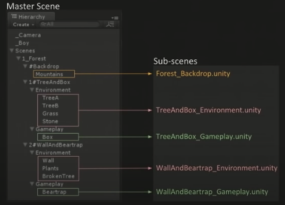
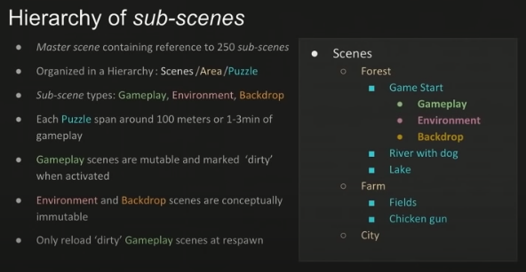

# Tools, Tricks and Technologies for Reaching Stutter Free 60 FPS in INSIDE

## Technology invisible to the player
- Technology should never cause distraction from the game experience.
	- Game can be completed from start to end without loading screens.
	- No visual artifacts.
	- No framerate stutters.

### Splitting content spatially
- Split spatially, and then save parts into sub-scenes.
	- Take background and put in scene called Backdrop.
	- Split foreground to environment and gameplay scenes.
- Master scene for the global objects.
- Separate sub-scenes for other objects.
	- They can be loaded/unloaded in memory as the game progresses.

### Hierarchy of sub-scenes

